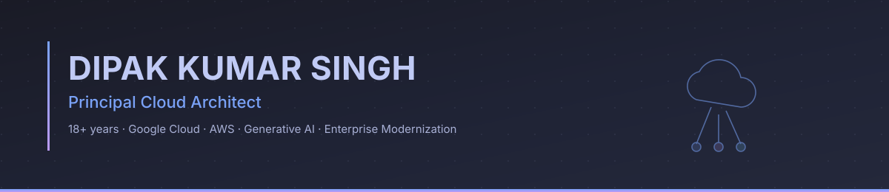
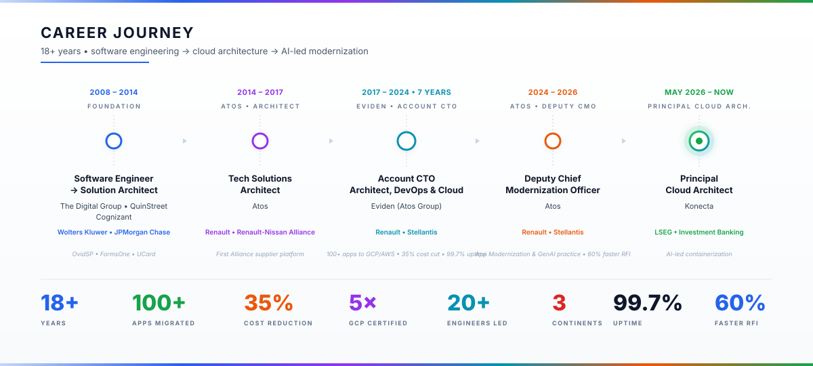

  

  
  
  

---

## Profile

Cloud Architect & Technology Leader with **18+ years** driving enterprise digital
transformation, cloud migration, and AI innovation across **automotive,
manufacturing, banking, and healthcare**. Proven track record migrating
**100+ applications** to GCP / AWS, building **GenAI agentic solutions**,
and leading distributed teams of **20+ across France, India, and the USA**.
**5× Google Cloud certified** with deep hands-on expertise in Kubernetes,
Terraform, and cloud-native architecture.

---

## Currently

> **Principal Cloud Architect** · *Konecta* · client *LSEG (London Stock Exchange Group)*
>
> Modernizing investment-banking workloads from monolith to cloud-native —
> leveraging AI for discovery, dependency mapping, refactoring, and
> Kubernetes-ready deployment patterns.

---

## Core Strengths

<table>
<tr>
  <td valign="top" width="33%">
    <b>Cloud & Infrastructure</b> 
    
    GCP (5× certified) · AWS 
    Kubernetes · Helm · Istio 
    Terraform · Ansible 
    GitOps · SRE · Linux
    
  </td>
  <td valign="top" width="33%">
    <b>AI / GenAI</b> 
    
    GPT-4 · Gemini · Claude 
    LangChain · LangGraph 
    Agentic systems 
    RAG & retrieval pipelines
    
  </td>
  <td valign="top" width="33%">
    <b>Architecture & Leadership</b> 
    
    Cloud-native design 
    Event-driven · 12-factor 
    Pre-sales & C-suite advisory 
    Team building (20+ engineers)
    
  </td>
</tr>
</table>

---

## Tech Stack

**Cloud & Infra**

**AI / GenAI**

**Languages & Backend**

**DevOps & CI/CD**

---

## Certifications

**Google Cloud — 5× Certified**

**Amazon Web Services**

---

## Selected Impact

| Outcome | Context |
| --- | --- |
| **100+ apps migrated** to GCP / AWS | Renault & Stellantis · 9+ years on the account |
| **35% infrastructure cost reduction** + 99.7% uptime | Cloud-native re-platforming on GKE & Cloud SQL |
| **60% faster RFI responses** | GenAI Knowledge Assist Agent (GPT-4 · Gemini) |
| **Application Modernization Practice** built from scratch | Atos — accelerators adopted across multiple accounts |
| **HP-UX → Rocky Linux 8 / GCVE** mission-critical migration | IBM MQ, WebSphere, Oracle; AI-assisted root cause analysis |
| **First Renault-Nissan Alliance** supplier-management platform | 15 features · team of 20 across France & India |

---

## Career Journey

  

<b>📜 Detailed role history (click to expand)</b>

 

<table>
<tr>
  <th>Period</th>
  <th>Role</th>
  <th>Employer</th>
  <th>Client</th>
  <th>Highlights</th>
</tr>

<tr>
  <td><b>May 2026 — Now</b></td>
  <td>Principal Cloud Architect</td>
  <td><b>Konecta</b></td>
  <td><i>LSEG · Investment Banking</i></td>
  <td>AI-led containerization of legacy workloads</td>
</tr>

<tr>
  <td>Jul 2024 — Apr 2026</td>
  <td>Deputy Chief Modernization Officer · Account CTO</td>
  <td><b>Atos</b></td>
  <td><i>Renault · Stellantis</i></td>
  <td>Built Application Modernization & GenAI practice · 60% faster RFI</td>
</tr>

<tr>
  <td>May 2017 — Jun 2024</td>
  <td>Account CTO — Architect, DevOps & Cloud</td>
  <td><b>Eviden</b></td>
  <td><i>Renault · Stellantis</i></td>
  <td>100+ apps to GCP / AWS · 35% cost reduction · 99.7% uptime</td>
</tr>

<tr>
  <td>Oct 2015 — Apr 2017</td>
  <td>Technical Solutions Architect</td>
  <td><b>Atos</b></td>
  <td><i>Renault-Nissan Alliance</i></td>
  <td>First Alliance supplier-management platform · team of 20</td>
</tr>

<tr>
  <td>Feb 2014 — Sep 2015</td>
  <td>Development & Delivery Architect</td>
  <td><b>Atos</b></td>
  <td><i>Renault</i></td>
  <td>Inventory management · reusable Maven components adopted across teams</td>
</tr>

<tr>
  <td>Aug 2012 — Feb 2014</td>
  <td>Solution Architect</td>
  <td><b>Cognizant</b></td>
  <td><i>JPMorgan Chase</i></td>
  <td>UCard (multi-state benefits) · Escrow Strategic Platform</td>
</tr>

<tr>
  <td>Aug 2010 — Jul 2012</td>
  <td>Senior Software Engineer</td>
  <td><b>QuinStreet</b></td>
  <td><i>In-house product</i></td>
  <td>FormsOne — unified lead-generation framework</td>
</tr>

<tr>
  <td>May 2008 — Jul 2010</td>
  <td>Software Engineer</td>
  <td><b>The Digital Group</b></td>
  <td><i>Wolters Kluwer</i></td>
  <td>OvidSP 2.0 medical search · rewrote PERL → Java/Struts2</td>
</tr>

</table>

**Industries** &nbsp;·&nbsp; Automotive &nbsp;·&nbsp; Manufacturing &nbsp;·&nbsp; Banking & Finance &nbsp;·&nbsp; Healthcare

---

## Selected Work & Recognition

- **Knowledge Assist Agent** &nbsp;·&nbsp; agentic GenAI scanning SharePoint and
  enterprise data sources to accelerate RFI responses by 60%
- **Technical Debt Scanner** &nbsp;·&nbsp; AI agent surfacing modernization
  candidates from legacy Java codebases
- **Terraform Generator** &nbsp;·&nbsp; LLM-driven IaC accelerator producing
  reusable, opinionated Terraform modules
- **Renault-Nissan Alliance Supplier Platform** &nbsp;·&nbsp; first-of-kind
  demand, capacity & scheduling platform shipped on time with a team of 20

> *More projects, talks, and writing being added — follow the repo or LinkedIn for updates.*

---

## Languages

**English** &nbsp; *fluent* &nbsp;·&nbsp; **French** &nbsp; *intermediate* (DELF B1 in progress) &nbsp;·&nbsp; **Hindi** &nbsp; *native*

---

## Let's Connect

I welcome conversations about **cloud architecture, AI-led modernization,
and engineering leadership**. Recruiters, fellow architects, and clients —
the door is open.

  

